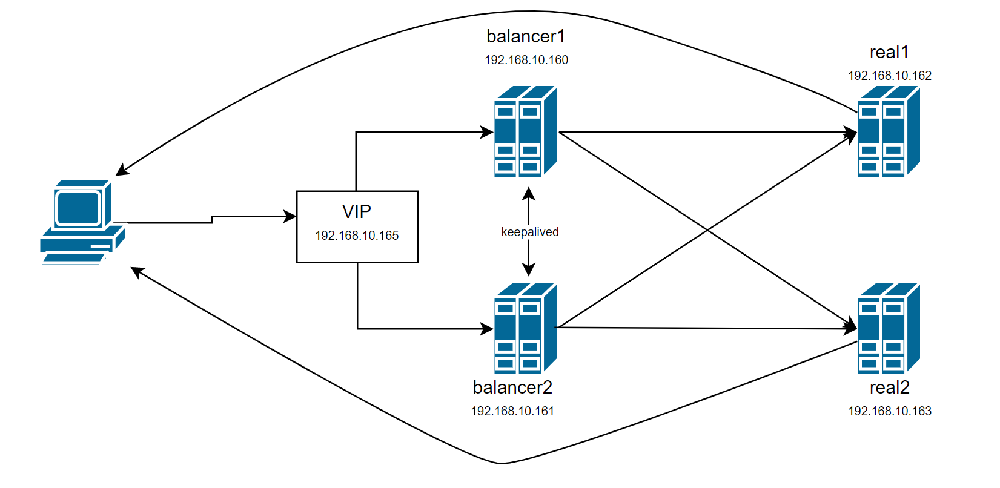

# Домашнее задание к занятию "3.8. Компьютерные сети, лекция 3"

**1. ipvs. Если при запросе на VIP сделать подряд несколько запросов (например, `for i in {1..50}; do curl -I -s 172.28.128.200>/dev/null; done `), ответы будут получены почти мгновенно. Тем не менее, в выводе `ipvsadm -Ln` еще некоторое время будут висеть активные `InActConn`. Почему так происходит?**

При работе по схеме DR или tunnel, director не видит пакетов от real-сервера клиенту. При завершении TCP-сессии стороны обмениваются пакетами с флагами FIN и ACK, director не видит части этих пакетов, и может только догадываться о завершении сессии по частичной информации. Поэтому он использует свои таймауты для закрытия соединений, и вот эти закрытые клиентом и real-сервером соединения мы видим в счетчике `InActConn`.  

**1. На лекции мы познакомились отдельно с ipvs и отдельно с keepalived. Воспользовавшись этими знаниями, совместите технологии вместе (VIP должен подниматься демоном keepalived). Приложите конфигурационные файлы, которые у вас получились, и продемонстрируйте работу получившейся конструкции. Используйте для директора отдельный хост, не совмещая его с риалом! Подобная схема возможна, но выходит за рамки рассмотренного на лекции.**

Я сделал 4 виртуальных машины, и назначил им такие адреса:  

  

На balancer1,2 установил keepalived, и написал такие конфиги:  
```buildoutcfg
! balancer1  
global_defs {
   router_id b_MASTER
}

vrrp_instance VI_1 {
   state MASTER
   interface eth0
   virtual_router_id 33
   priority 100
   advert_int 1
   authentication {
      auth_type PASS
      auth_pass netology_secret
   }
   virtual_ipaddress {
   192.168.10.165/32 dev eth0
   }
}

virtual_server 192.168.10.165 80 {
    protocol TCP
    delay_loop 10
    lvs_sched rr
    lvs_method DR

    real_server 192.168.10.162 80 {
        TCP_CHECK {
            connect_timeout 3
        }
    }

    real_server 192.168.10.163 80 {
        TCP_CHECK {
            connect_timeout 3
        }
    }
}

```  
  
```buildoutcfg
! balancer2  
global_defs {
   router_id b_BACKUP
}

vrrp_instance VI_1 {
   state BACKUP
   interface eth0
   virtual_router_id 33
   priority 50
   advert_int 1
   authentication {
      auth_type PASS
      auth_pass netology_secret
   }
   virtual_ipaddress {
   192.168.10.165/32 dev eth0
   }
}

virtual_server 192.168.10.165 80 {
    protocol TCP
    delay_loop 10
    lvs_sched rr
    lvs_method DR

    real_server 192.168.10.162 80 {
        TCP_CHECK {
            connect_timeout 3
        }
    }

    real_server 192.168.10.163 80 {
        TCP_CHECK {
            connect_timeout 3
        }
    }
}

```
после чего перезагрузил keepalived  
```
systemctl reload keepalived
```  

На real1 и 2 установил nginx, добавил VIP на loopback:  
```
ip addr add 192.168.10.165/32 dev lo label lo:165
```
и запретил анонсировать его по arp:  
```
sysctl -w net.ipv4.conf.all.arp_ignore=1  
sysctl -w net.ipv4.conf.all.arp_announce=2
```

В результате:  
На обоих машинах balancer появились правила ipvsadm  
```
IP Virtual Server version 1.2.1 (size=4096)
Prot LocalAddress:Port Scheduler Flags
  -> RemoteAddress:Port           Forward Weight ActiveConn InActConn
TCP  192.168.10.165:80 rr
  -> 192.168.10.162:80            Route   1      0          0
  -> 192.168.10.163:80            Route   1      0          0
```  
На balancer1 у keepalived статус  
```
Oct 22 14:39:02 balancer1 Keepalived_vrrp[679]: (VI_1) Entering MASTER STATE
```
а на balancer2 ```Oct 22 14:38:58 balancer1 Keepalived_vrrp[679]: (VI_1) Entering BACKUP STATE```,  
при отключении первого второй становится мастером:  
```
Oct 22 14:46:28 balancer2 Keepalived_vrrp[676]: (VI_1) Backup received priority 0 advertisement
Oct 22 14:46:29 balancer2 Keepalived_vrrp[676]: (VI_1) Entering MASTER STATE
```  
А если balancer1 снова включить - отдает мастера обратно:  
```
Oct 22 14:48:46 balancer2 Keepalived_vrrp[676]: (VI_1) Master received advert from 192.168.10.160 with higher priority 100, ours 50
Oct 22 14:48:46 balancer2 Keepalived_vrrp[676]: (VI_1) Entering BACKUP STATE
```  
При запуске с консоли ```curl -I -s 192.168.10.165:80``` возвращается ```HTTP/1.1 200 OK```,  
а активный balancer распределяет такие соединения поочередно на real1 и real2:  
```
vagrant@real1:~$ wc -l /var/log/nginx/access.log
52 /var/log/nginx/access.log
```  
```
vagrant@real2:~$ wc -l /var/log/nginx/access.log
53 /var/log/nginx/access.log
```  
```vagrant@balancer1:~$ sudo ipvsadm -Ln
IP Virtual Server version 1.2.1 (size=4096)
Prot LocalAddress:Port Scheduler Flags
  -> RemoteAddress:Port           Forward Weight ActiveConn InActConn
TCP  192.168.10.165:80 rr
  -> 192.168.10.162:80            Route   1      0          25
  -> 192.168.10.163:80            Route   1      0          25
```

**3. В лекции мы использовали только 1 VIP адрес для балансировки. У такого подхода несколько отрицательных моментов, один из которых – невозможность активного использования нескольких хостов (1 адрес может только переехать с master на standby). Подумайте, сколько адресов оптимально использовать, если мы хотим без какой-либо деградации выдерживать потерю 1 из 3 хостов при входящем трафике 1.5 Гбит/с и физических линках хостов в 1 Гбит/с? Предполагается, что мы хотим задействовать 3 балансировщика в активном режиме (то есть не 2 адреса на 3 хоста, один из которых в обычное время простаивает).**  


Равномерно распределять запросы на несколько VIP-адресов можно при помощи DNS round robin. Сколько нужно адресов? Если сделать 3 адреса, по одному на каждый хост, то при недоступности одного хоста-балансировщика, его часть трафика 0.5Гб/с перейдет на один из двух оставшихся, забив его канал полностью. Для того, чтобы распределить трафик одного отказавшего хоста, нужно использовать шесть адресов.  

| balancer1   | balancer2   | balancer3   |
|-------------|-------------|-------------|
| VIP1 MASTER | VIP3 MASTER | VIP5 MASTER |
| VIP2 MASTER | VIP4 MASTER | VIP6 MASTER |
| VIP3 BACKUP | VIP1 BACKUP | VIP2 BACKUP |  
| VIP5 BACKUP | VIP6 BACKUP | VIP4 BACKUP |  

При потере любого из трех хостов по такой схеме, нагрузка равномерно распределится между оставшимися.  

 
---

### Как оформить ДЗ?

Домашнее задание выполните в файле readme.md в github репозитории. В личном кабинете отправьте на проверку ссылку на .md-файл в вашем репозитории.

Также вы можете выполнить задание в [Google Docs](https://docs.google.com/document/u/0/?tgif=d) и отправить в личном кабинете на проверку ссылку на ваш документ.
Название файла Google Docs должно содержать номер лекции и фамилию студента. Пример названия: "1.1. Введение в DevOps — Сусанна Алиева"
Перед тем как выслать ссылку, убедитесь, что ее содержимое не является приватным (открыто на комментирование всем, у кого есть ссылка). 
Если необходимо прикрепить дополнительные ссылки, просто добавьте их в свой Google Docs.

Любые вопросы по решению задач задавайте в чате Slack.

---
